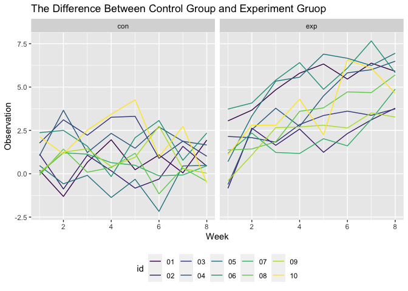
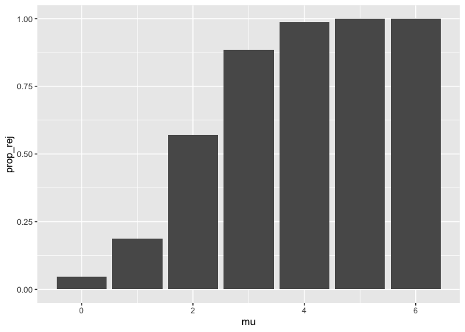
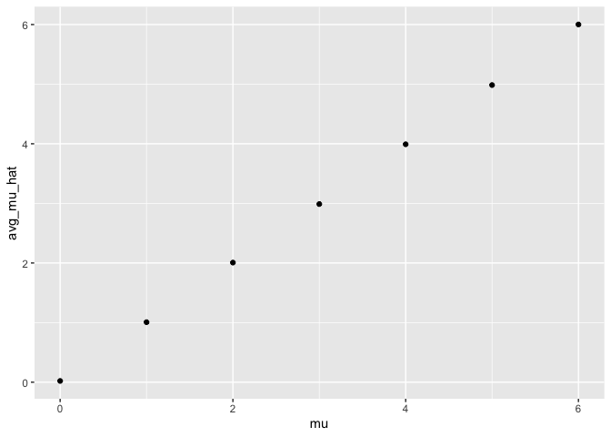
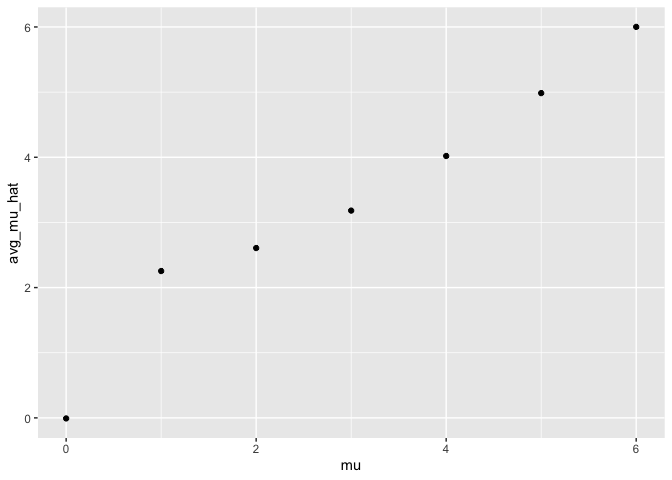

p8105\_hw5\_js5095
================
Jianting Shi
2020-11-18

``` r
library(tidyverse)
```

    ## ── Attaching packages ─────────────────────────────────────── tidyverse 1.3.0 ──

    ## ✓ ggplot2 3.3.2     ✓ purrr   0.3.4
    ## ✓ tibble  3.0.4     ✓ dplyr   1.0.2
    ## ✓ tidyr   1.1.2     ✓ stringr 1.4.0
    ## ✓ readr   1.4.0     ✓ forcats 0.5.0

    ## ── Conflicts ────────────────────────────────────────── tidyverse_conflicts() ──
    ## x dplyr::filter() masks stats::filter()
    ## x dplyr::lag()    masks stats::lag()

``` r
#library(rvest)
```

# Problem 2

## Create a tidy dataframe containing data from all participants, including the subject ID, arm, and observations over time

``` r
# Create variable to store a list of data
longit_study = list.files("./Data")

# Create a function to read in lists of data
longit_study_df = function(x) {
  read_df = read_csv(paste0("./Data/", x)) %>% 
    mutate(arm_id = str_sub(x, end = 6))
    
  read_df
}

# Iterate over files with the function and save the output in dataframe
output = purrr::map(longit_study, longit_study_df)
```

    ## 
    ## ── Column specification ────────────────────────────────────────────────────────
    ## cols(
    ##   week_1 = col_double(),
    ##   week_2 = col_double(),
    ##   week_3 = col_double(),
    ##   week_4 = col_double(),
    ##   week_5 = col_double(),
    ##   week_6 = col_double(),
    ##   week_7 = col_double(),
    ##   week_8 = col_double()
    ## )
    ## 
    ## 
    ## ── Column specification ────────────────────────────────────────────────────────
    ## cols(
    ##   week_1 = col_double(),
    ##   week_2 = col_double(),
    ##   week_3 = col_double(),
    ##   week_4 = col_double(),
    ##   week_5 = col_double(),
    ##   week_6 = col_double(),
    ##   week_7 = col_double(),
    ##   week_8 = col_double()
    ## )
    ## 
    ## 
    ## ── Column specification ────────────────────────────────────────────────────────
    ## cols(
    ##   week_1 = col_double(),
    ##   week_2 = col_double(),
    ##   week_3 = col_double(),
    ##   week_4 = col_double(),
    ##   week_5 = col_double(),
    ##   week_6 = col_double(),
    ##   week_7 = col_double(),
    ##   week_8 = col_double()
    ## )
    ## 
    ## 
    ## ── Column specification ────────────────────────────────────────────────────────
    ## cols(
    ##   week_1 = col_double(),
    ##   week_2 = col_double(),
    ##   week_3 = col_double(),
    ##   week_4 = col_double(),
    ##   week_5 = col_double(),
    ##   week_6 = col_double(),
    ##   week_7 = col_double(),
    ##   week_8 = col_double()
    ## )
    ## 
    ## 
    ## ── Column specification ────────────────────────────────────────────────────────
    ## cols(
    ##   week_1 = col_double(),
    ##   week_2 = col_double(),
    ##   week_3 = col_double(),
    ##   week_4 = col_double(),
    ##   week_5 = col_double(),
    ##   week_6 = col_double(),
    ##   week_7 = col_double(),
    ##   week_8 = col_double()
    ## )
    ## 
    ## 
    ## ── Column specification ────────────────────────────────────────────────────────
    ## cols(
    ##   week_1 = col_double(),
    ##   week_2 = col_double(),
    ##   week_3 = col_double(),
    ##   week_4 = col_double(),
    ##   week_5 = col_double(),
    ##   week_6 = col_double(),
    ##   week_7 = col_double(),
    ##   week_8 = col_double()
    ## )
    ## 
    ## 
    ## ── Column specification ────────────────────────────────────────────────────────
    ## cols(
    ##   week_1 = col_double(),
    ##   week_2 = col_double(),
    ##   week_3 = col_double(),
    ##   week_4 = col_double(),
    ##   week_5 = col_double(),
    ##   week_6 = col_double(),
    ##   week_7 = col_double(),
    ##   week_8 = col_double()
    ## )
    ## 
    ## 
    ## ── Column specification ────────────────────────────────────────────────────────
    ## cols(
    ##   week_1 = col_double(),
    ##   week_2 = col_double(),
    ##   week_3 = col_double(),
    ##   week_4 = col_double(),
    ##   week_5 = col_double(),
    ##   week_6 = col_double(),
    ##   week_7 = col_double(),
    ##   week_8 = col_double()
    ## )
    ## 
    ## 
    ## ── Column specification ────────────────────────────────────────────────────────
    ## cols(
    ##   week_1 = col_double(),
    ##   week_2 = col_double(),
    ##   week_3 = col_double(),
    ##   week_4 = col_double(),
    ##   week_5 = col_double(),
    ##   week_6 = col_double(),
    ##   week_7 = col_double(),
    ##   week_8 = col_double()
    ## )
    ## 
    ## 
    ## ── Column specification ────────────────────────────────────────────────────────
    ## cols(
    ##   week_1 = col_double(),
    ##   week_2 = col_double(),
    ##   week_3 = col_double(),
    ##   week_4 = col_double(),
    ##   week_5 = col_double(),
    ##   week_6 = col_double(),
    ##   week_7 = col_double(),
    ##   week_8 = col_double()
    ## )
    ## 
    ## 
    ## ── Column specification ────────────────────────────────────────────────────────
    ## cols(
    ##   week_1 = col_double(),
    ##   week_2 = col_double(),
    ##   week_3 = col_double(),
    ##   week_4 = col_double(),
    ##   week_5 = col_double(),
    ##   week_6 = col_double(),
    ##   week_7 = col_double(),
    ##   week_8 = col_double()
    ## )
    ## 
    ## 
    ## ── Column specification ────────────────────────────────────────────────────────
    ## cols(
    ##   week_1 = col_double(),
    ##   week_2 = col_double(),
    ##   week_3 = col_double(),
    ##   week_4 = col_double(),
    ##   week_5 = col_double(),
    ##   week_6 = col_double(),
    ##   week_7 = col_double(),
    ##   week_8 = col_double()
    ## )
    ## 
    ## 
    ## ── Column specification ────────────────────────────────────────────────────────
    ## cols(
    ##   week_1 = col_double(),
    ##   week_2 = col_double(),
    ##   week_3 = col_double(),
    ##   week_4 = col_double(),
    ##   week_5 = col_double(),
    ##   week_6 = col_double(),
    ##   week_7 = col_double(),
    ##   week_8 = col_double()
    ## )
    ## 
    ## 
    ## ── Column specification ────────────────────────────────────────────────────────
    ## cols(
    ##   week_1 = col_double(),
    ##   week_2 = col_double(),
    ##   week_3 = col_double(),
    ##   week_4 = col_double(),
    ##   week_5 = col_double(),
    ##   week_6 = col_double(),
    ##   week_7 = col_double(),
    ##   week_8 = col_double()
    ## )
    ## 
    ## 
    ## ── Column specification ────────────────────────────────────────────────────────
    ## cols(
    ##   week_1 = col_double(),
    ##   week_2 = col_double(),
    ##   week_3 = col_double(),
    ##   week_4 = col_double(),
    ##   week_5 = col_double(),
    ##   week_6 = col_double(),
    ##   week_7 = col_double(),
    ##   week_8 = col_double()
    ## )
    ## 
    ## 
    ## ── Column specification ────────────────────────────────────────────────────────
    ## cols(
    ##   week_1 = col_double(),
    ##   week_2 = col_double(),
    ##   week_3 = col_double(),
    ##   week_4 = col_double(),
    ##   week_5 = col_double(),
    ##   week_6 = col_double(),
    ##   week_7 = col_double(),
    ##   week_8 = col_double()
    ## )
    ## 
    ## 
    ## ── Column specification ────────────────────────────────────────────────────────
    ## cols(
    ##   week_1 = col_double(),
    ##   week_2 = col_double(),
    ##   week_3 = col_double(),
    ##   week_4 = col_double(),
    ##   week_5 = col_double(),
    ##   week_6 = col_double(),
    ##   week_7 = col_double(),
    ##   week_8 = col_double()
    ## )
    ## 
    ## 
    ## ── Column specification ────────────────────────────────────────────────────────
    ## cols(
    ##   week_1 = col_double(),
    ##   week_2 = col_double(),
    ##   week_3 = col_double(),
    ##   week_4 = col_double(),
    ##   week_5 = col_double(),
    ##   week_6 = col_double(),
    ##   week_7 = col_double(),
    ##   week_8 = col_double()
    ## )
    ## 
    ## 
    ## ── Column specification ────────────────────────────────────────────────────────
    ## cols(
    ##   week_1 = col_double(),
    ##   week_2 = col_double(),
    ##   week_3 = col_double(),
    ##   week_4 = col_double(),
    ##   week_5 = col_double(),
    ##   week_6 = col_double(),
    ##   week_7 = col_double(),
    ##   week_8 = col_double()
    ## )
    ## 
    ## 
    ## ── Column specification ────────────────────────────────────────────────────────
    ## cols(
    ##   week_1 = col_double(),
    ##   week_2 = col_double(),
    ##   week_3 = col_double(),
    ##   week_4 = col_double(),
    ##   week_5 = col_double(),
    ##   week_6 = col_double(),
    ##   week_7 = col_double(),
    ##   week_8 = col_double()
    ## )

``` r
study_results = bind_rows(output) 

# Tidy the data
longitstudy = 
  study_results %>% 
  pivot_longer(week_1:week_8,
               names_to = "week", 
               values_to = "observation") %>% 
  mutate(week = str_replace(week, 'week_', '')) %>% 
  mutate(week = as.numeric(week)) %>% 
  separate(arm_id, into = c("arm", "id"), sep = "_")
```

A list of csv files have been read and stored into a dataframe, which
has the following variables: arm, id, week, observation, containing 160
rows and 4 columns.

## Make a spaghetti plot showing observations on each subject over time, and comment on differences between groups.

``` r
ggplot(longitstudy, aes(x = week, y = observation, color = id)) +
  facet_grid(~as.factor(arm)) +
  geom_line() +
  labs(
    title = "The Difference Between Control Group and Experiment Gruop",
    x = "Week",
    y = "Observation"
  ) +
  viridis::scale_color_viridis(
    discrete = TRUE
  ) + 
  theme(legend.position = "bottom")
```

<!-- -->

# Problem 3

## Set up 3 functions to simulate data and perform t-tests

``` r
set.seed(11)

sim_data = function(size = 5000, n = 30, mu = 0, s = 5){
  data = vector("list", size)
  for(i in 1:size){
    data[[i]] = rnorm(n, mean = mu, sd = s)
  }
  data
}

t_test_1sample = function(x, mu=0){
  output = t.test(x, mu = mu) %>%
    broom::tidy() %>%
    select(estimate, p.value) %>%
    as.numeric()
  
  tbl = tibble(
    mu_h = output[1],
    p_val = output[2]
  )
  tbl
}

t_test_1sample_batch = function(x, size = 5000, mu=0){
  test_data = vector("list", size)
  for(i in 1:size){
    test_data[[i]] = t_test_1sample(x[[i]], mu)
  }
  test_data
}
```

## Generate 7 lists with \(\mu\) ={0,1,2,3,4,5,6}. Each list contains 5000 datasets of \(n=30\), with fixed \(\sigma\) = 5.

``` r
all_sim_data = vector("list", 7)
all_test_data = vector("list",7)

### Test mu = 0
for(i in 0:6){
  all_sim_data[[i+1]] = sim_data(mu=i)
  all_test_data[[i+1]] = t_test_1sample_batch(all_sim_data[[i+1]])
  all_test_data[[i+1]] = bind_rows(all_test_data[[i+1]])
}
```

## Plot 1. the proportion of times the null was rejected (the power of the test) on the y axis and the true value of \(\mu\) on the x axis.

As the \(\mu\) moves further away from 0, which suggests the increase of
effect size, the proportion of times that the null was rejected (the
power of the test) increases significantly. When \(\mu\) \>= 5 the power
is very close to 1.

``` r
test_rejection = tibble()
for (i in 0:6) {
  temp_rej = tibble(
    mu = i,
    prop_rej = sum(all_test_data[[i+1]][2]<0.05)/5000
  ) 
  test_rejection = rbind(test_rejection, temp_rej)
}

test_rejection %>% ggplot(aes(x=mu, y = prop_rej)) + geom_bar(stat = "identity")
```

<!-- -->

## Plot 2. the average estimate of \(\hat\mu\) on the y axis and the true value of \(\mu\) on the \(x\) axis.

``` r
avg_mu_hat = tibble()
for(i in 0:6){
  mean = all_test_data[[i+1]] %>%
    select(mu_h) %>%
    summarize(mean = mean(mu_h))
  
  temp_mu_hat = tibble(
    mu = i,
    avg_mu_hat = as.numeric(mean)
  ) 
  avg_mu_hat = rbind(avg_mu_hat, temp_mu_hat)
}

avg_mu_hat %>% ggplot(aes(x = mu, y = avg_mu_hat)) + geom_point()
```

<!-- -->

## Plot 3. the average estimate of \(\hat\mu\) only in samples for which the null was rejected on the y axis and the true value of \(\mu\) on the \(x\) axis.

The sample average of \(\hat\mu\) accross tests for which the null is
rejected does not always approximately equal to the true value,
especially when the true \(\mu\) is close to 0. This is expected as when
the null hypothesis is close to the truth, selecting the rejected tests
biased the samples to have means that are away from \(\mu\).

``` r
avg_mu_hat_rej = tibble()
for(i in 0:6){
  mean_rej = all_test_data[[i+1]] %>%
    filter(p_val < 0.05) %>%
    select(mu_h) %>%
    summarize(mean = mean(mu_h))
  
  temp_mu_hat = tibble(
    mu = i,
    avg_mu_hat = as.numeric(mean_rej)
  )
  avg_mu_hat_rej = rbind(avg_mu_hat_rej, temp_mu_hat)
  
}

avg_mu_hat_rej %>% ggplot(aes(x = mu, y = avg_mu_hat)) + geom_point()
```

<!-- -->
